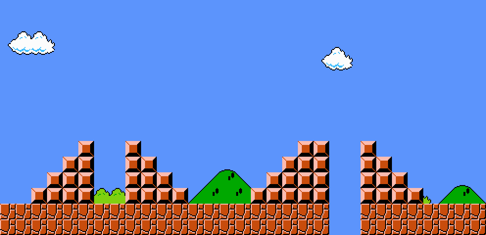

# Super Mario Stairs

Super Mario Bros. (1985) is arguably the most iconic videogame of all time.

Even though the game has 32 levels, many speedrunners can beat the entire thing in under five minutes.

However, even the most accomplished speedrunners can have their runs foiled by a run in with the dreaded stairs:



One wrong move on these steps, and your momentum is gone, and with it, any chance of a world-record time.

## The Goal

We're going to write three methods: one to build downward stairs, one to build upward stairs, and one to build pyramid stairs (they go up and then go down).

Here's what your code should ultimately be able to do:

###### Code for descending stairs:

```ruby
downstairs(4)
```

The code above should print a descending staircase of four steps to the console like this:

```bash
#
##
###
####
```

###### Code for ascending stairs:

```ruby
upstairs(6)
```

The code above should print an ascending staircase of six steps to the console like this:

```bash
     #
    ##
   ###
  ####
 #####
######
```

###### Code for pyramid stairs:

```ruby
pyramid(4)
```

The code above should print an ascending staircase of 4 steps and it's mirror descending staircase to the console like this:

```bash
   # #
  ## ##
 ### ###
#### ####
```
